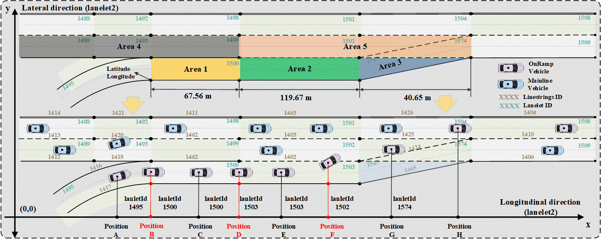

# A-reproducible-approach-to-merging-behavior-analysis-based-on-High-Definition-Map

## About
This project contains the source code and data for the paper titled "A reproducible approach to merging behavior analysis based on High Definition Map".

### Citation

If our work is helpful for your research, please consider citing the following BibTeX entry in your manuscript:


```
@article{
    Yang Li, 2023
    "https://arxiv.org/abs/2303.11531"
    title={A reproducible approach to merging behavior analysis based on High Definition Map}, 
    author={Yang Li and Yang Liu and Daiheng Ni and Ang Ji and Linbo Li and Yajie Zou},
    year={2023},
    eprint={2303.11531},
    archivePrefix={arXiv},
    primaryClass={cs.RO}
}
```

### Code Structure

```
A reproducible approach to merging behavior analysis based on High Definition Map/
|__ asset: analysis results
|    |__ acceptedGaps
|    |__ backgroundPicture
|    |__ consecutiveLaneChange
|    |__ JSDivergence
|    |__ preliminaryAnalysis
|    |__ safetyAnalysis
|    |__ table
|    |__ trafficFlowSpeed
|__ conf: experiment configurations
|    |__ lanelet2map
|__ drone-dataset-tools-master: dataset
|__ src: merging trajectories extraction, indicators calculation, results visulization
|    |__ extraction
|    |__ figure
|    |    |__accepetedGapAnalysis
|    |    |__consecutiveLanechangeAnalysis
|    |    |__preliminaryAnalysis
|    |    |__safetyAnalysis
|    |    |__similarityAnalysis
|    |    |__trafficFlowSpeedDensity
|    |__ table
|__ utils: utility functions
|__ requirements.txt: required packages
```


**Abstract:**
Existing research on merging behavior generally prioritize the application of various algorithms, but often overlooks the fine-grained process and analysis of trajectories. This leads to the neglect of surrounding vehicle matching, the opaqueness of indicators definition, and reproducible crisis. To address these gaps, this paper presents a reproducible approach to merging behavior analysis. Specifically, we outline the causes of subjectivity and irreproducibility in existing studies. Thereafter, we employ lanelet2 High Definition (HD) map to construct a reproducible framework, that minimizes subjectivities, defines standardized indicators, identifies alongside vehicles, and divides scenarios. A comparative macroscopic and microscopic analysis is subsequently conducted. More importantly, this paper adheres to the Reproducible Research concept, providing all the source codes and reproduction instructions. Our results demonstrate that although scenarios with alongside vehicles occur in less than 6% of cases, their characteristics are significantly different from others, and these scenarios are often accompanied by high risk. This paper refines the understanding of merging behavior, raises awareness of reproducible studies, and serves as a watershed moment.

**Keywords:**
Merging Behavior, High Definition Map, Reproducible Research, exiD dataset.


## Install

* Create new conda environment

You are recommended to create a new Conda environment to install the project
```bash
conda create -n MBA python=3.7
conda activate MBA
```

* Clone this repo

```bash
git clone https://github.com/iyangli/A-reproducible-approach-to-merging-behavior-analysis-based-on-High-Definition-Map.git
```

* Install all required packages
```bash
pip install -r requirements.txt
```

## Usage

### Application of HD Map of merging area

Below shows the lanlet2 HD map for location 2. We divide the merging area into: Area 1: Vehicles approach the acceleration lane from the on-ramp. The current laneletId is 1500, with a total length of 67.56m. Area 2: The left side of a vehicle is a dashed line, and it could merge into the mainline within this area. The current laneletId is 1503, with a total length of 119.57m. Area 3: The acceleration lane gradually disappears and lane drops from three to two. The current laneletId and length are 1567 and 40.65m. Area 4: This area is the upstream of the mainline outer lane within the merging area. It contains three laneletIds, 1489, 1493 and 1499, with lengths of 81.7m, 29.78m, and 67.87m. Area 5: vehicles travel from the acceleration lane to this area and may interact with mainline vehicles. The current laneletId is 1502, 1574 and the length is 119.45m, 40.65m.




### Comparative microscopic and macroscopic analysis
**Research bullets**
```
1. Merging distance
2. Merging distance ratio
3. Merging duration
4. Merging lateral trajectory
5. Merging lateral speed
6. Scenario classification
7. Alongside vehicle identification
8. HD map pre-labeling
9. Standardized indicators
10. Safety analysis
11. Traffic flow-density-speed
12. Accepted gap analysis
13. Scenario similarity
14. Consecutive lane-changing duration
```


## Contributing

Contributions are what make the open source community such an amazing place to be learn, inspire, and create. Any contributions you make are **greatly appreciated**.

## Developers
Yang Li ( yangli.chn@outlook.com )

Yang Liu ( iseliuy@nus.edu.sg )

Daiheng Ni ( ni@engin.umass.edu )

Ang Ji ( ang.ji@swjtu.edu.cn )

Linbo Li ( llinbo@tongji.edu.cn )

Yajie Zou ( yajiezou@hotmail.com )


For help or issues using the code, please create an issue for this repository or contact Yang Li ( yangli.chn@outlook.com ).


## Contact

For general questions about the paper, please contact Yang Li ( llinbo@tongji.edu.cn ).

